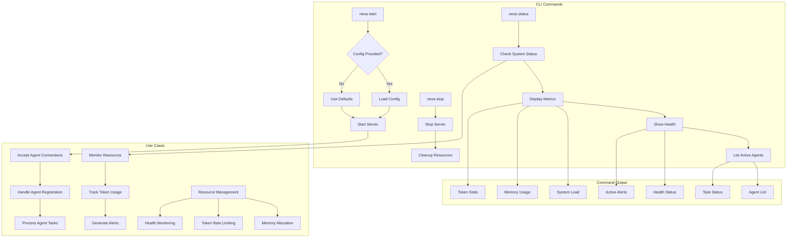
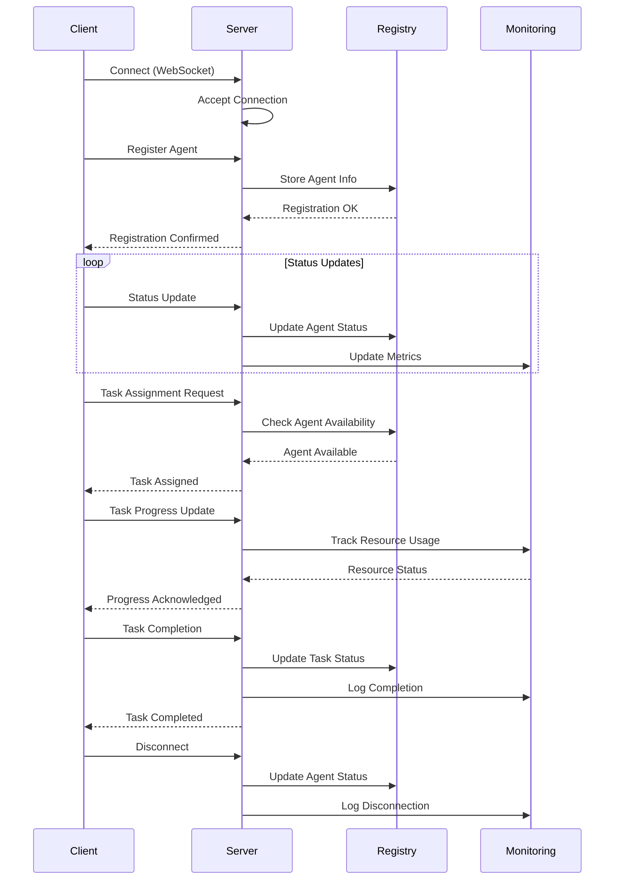

# Nexa Utils Architecture

## System Overview

```mermaid
graph TD
    A[Client Applications] --> B[CLI Interface]
    B --> C[MCP System]
    C --> D[Agent Integration]
    C --> E[Generation Pipeline]
    C --> F[Safety Features]
    
    subgraph Core Components
        G[Memory Management]
        H[Token Management]
        I[Resource Monitoring]
        J[Health Checks]
    end
    
    subgraph MCP System
        K[WebSocket Server]
        L[Protocol Validation]
        M[Message Handling]
        N[Connection Management]
    end
    
    subgraph Safety Features
        O[Resource Limits]
        P[Token Rate Limiting]
        Q[Health Monitoring]
        R[Alert System]
    end
    
    C --> Core Components
    F --> Safety Features
```

## Implementation Status

### Fully Implemented

- Memory Management System
  - Resource allocation tracking
  - Memory usage monitoring
  - Cache management
  - Resource pooling
- Token Management
  - Usage tracking per model
  - Cost calculation
  - Rate limiting
  - Usage optimization
- Multi-agent Control Protocol (MCP)
  - WebSocket server
  - Protocol validation
  - Message handling
  - Connection management
- Monitoring System
  - Real-time metrics collection
  - Health checks with configurable thresholds
  - Alert system
  - Resource tracking

### Partially Implemented

- CLI Interface
  - Basic command structure
  - Core commands
  - Configuration management
- Agent Integration
  - Basic agent types
  - Agent lifecycle management
- Generation Pipeline
  - Basic pipeline structure
  - Model integration

### Planned Features

- Enhanced Security Features
  - Advanced authentication
  - Role-based access control
- Distributed System Support
  - Cluster management
  - Load balancing
- Advanced Analytics
  - Usage patterns
  - Performance metrics
  - Cost optimization

## Core Components

### Memory Management

The memory management system provides:

- Real-time tracking of resource allocation
- Memory usage monitoring with configurable thresholds
- Efficient cache management for frequently accessed data
- Resource pooling for optimal utilization

### Token Management

Token management features include:

- Per-model token usage tracking
- Cost calculation and analytics
- Rate limiting with configurable thresholds
- Usage optimization strategies

### Monitoring System

The monitoring system offers:

- Real-time system metrics collection
- Health checks with configurable thresholds
- Alert system for resource usage and system health
- Comprehensive resource tracking

### MCP (Multi-agent Control Protocol)

The MCP system provides:

- WebSocket-based communication
- Protocol validation and message handling
- Connection management
- Agent coordination

## Safety Features

### Resource Management

- Memory limits with configurable thresholds
- CPU usage monitoring and control
- Disk space management
- Network bandwidth control

### Error Handling

- Comprehensive error types
- Recovery strategies
- Logging and monitoring
- Alert system integration

### Health Monitoring

- System health checks
- Resource utilization monitoring
- Performance metrics
- Alert thresholds

## Development Guidelines

### Code Organization

- Modular architecture
- Clear separation of concerns
- Comprehensive documentation
- Test coverage

### Testing Strategy

- Unit tests for core components
- Integration tests for system interactions
- Performance testing
- Security testing

### Documentation

- Code documentation
- API documentation
- Architecture documentation
- User guides

## Future Enhancements

### Planned Improvements

- Enhanced security features
- Distributed system support
- Advanced analytics
- Performance optimizations

### Research Areas

- Advanced resource management
- Improved monitoring systems
- Enhanced safety features
- Scalability improvements

## CLI Command Flow



## CLI Usage Examples

```bash
# Start the server with default configuration
nexa start

# Start with custom config file
nexa start --config custom.toml

# Check system status
nexa status

# Stop the server
nexa stop
```

### Command Output Examples

1. Status Command Output:

```
System Status:
CPU Load: 45%
Memory: 2.4GB/4GB
Active Agents: 3
Token Usage: 15.2K/hour
Health: Healthy
Recent Alerts: None
```

2. Agent List Output:

```
Active Agents:
- agent-1 (Status: Running, Tasks: 2)
- agent-2 (Status: Idle)
- agent-3 (Status: Processing)

Recent Tasks:
- Task-001: Completed
- Task-002: In Progress
- Task-003: Queued
```

3. Resource Usage:

```
Memory Allocation:
- Token Buffers: 512MB
- Cache: 256MB
- Active Contexts: 128MB

Token Usage (Last Hour):
- GPT4: 10.5K tokens
- Claude: 4.7K tokens
```

## Protocol Message Flow



This diagram shows the interaction between different components during typical agent operations, including:

- Connection establishment
- Agent registration
- Status updates
- Task assignment and progress tracking
- Resource monitoring
- Disconnection handling
