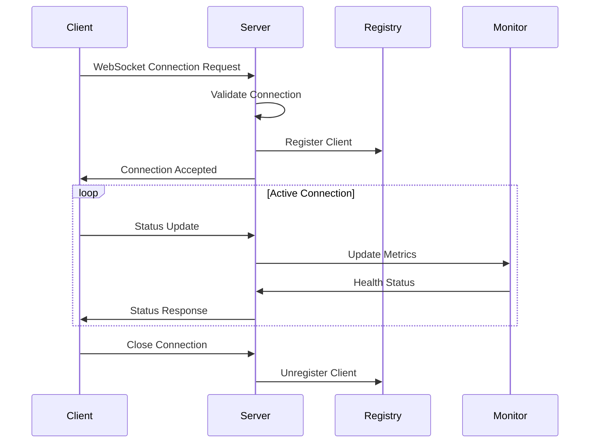
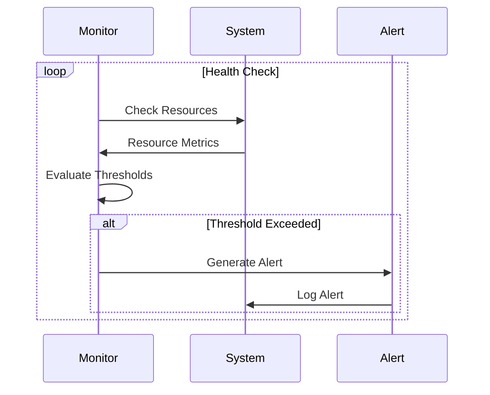
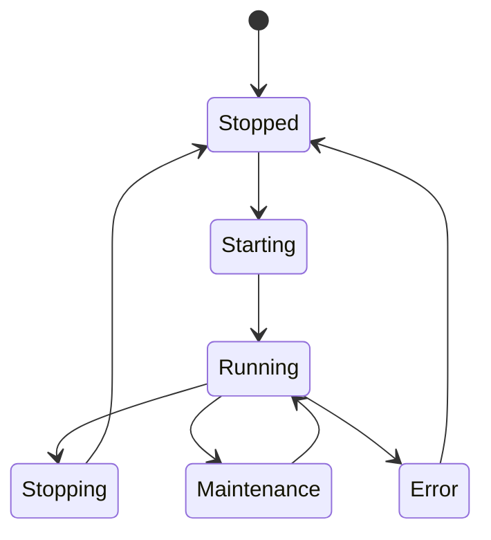
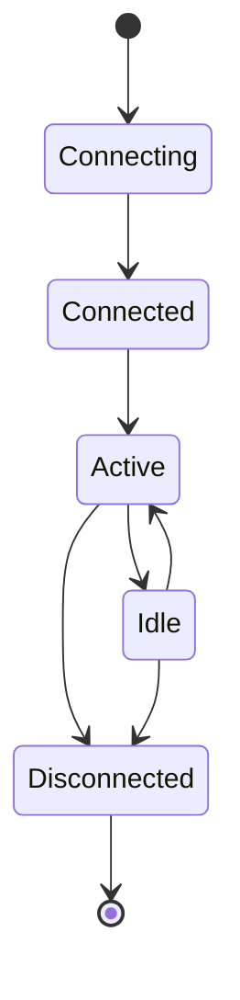

# Nexa Utils Architecture

## Overview

Nexa Utils is built with a modular architecture focusing on reliability, scalability, and maintainability. The system is composed of several key components that work together to provide a robust multi-agent control and monitoring solution.

## System Components

### 1. Multi-agent Control Protocol (MCP)

The MCP module handles all agent communication and coordination:

mcp/
├── mod.rs         # Main MCP implementation
├── protocol.rs    # Protocol definitions and validation
├── registry.rs    # Agent registration and tracking
├── server.rs      # WebSocket server implementation
├── cluster.rs     # Cluster coordination
└── loadbalancer.rs # Load balancing logic

Key features:

- WebSocket-based communication with automatic reconnection
- Protocol validation and message handling
- Secure connection management
- Real-time status updates and metrics
- Load balancing and failover
- Cluster coordination

### 2. Monitoring System

The monitoring module provides comprehensive system monitoring:

monitoring/
├── mod.rs        # Main monitoring implementation
├── metrics.rs    # Metrics collection and processing
├── alerts.rs     # Alert system
└── health.rs     # Health check implementation

Features:

- Real-time metrics collection (CPU, Memory, Network)
- Health checks with configurable thresholds
- Alert system with multiple severity levels
- Resource tracking and usage optimization
- Metric persistence and analysis

### 3. CLI Interface

The CLI module provides a user-friendly command interface:

cli/
├── mod.rs        # Main CLI implementation
├── commands.rs   # Command definitions
└── output.rs     # Output formatting

Features:

- Server control (start/stop/status)
- Configuration management
- Status monitoring and reporting
- Resource usage visualization

### 4. Memory Management

The memory module handles resource allocation and tracking:

memory/
├── mod.rs        # Main memory management
├── allocator.rs  # Memory allocation
└── cache.rs      # Caching implementation

Features:

- Resource allocation tracking
- Memory usage monitoring
- Cache management
- Resource pooling

## Communication Flow

### WebSocket Communication

### Health Monitoring

## State Management

### Server States

### Connection States

## Error Handling

The system implements a comprehensive error handling strategy:

1. Error Types
   - System Errors
   - Protocol Errors
   - Connection Errors
   - Resource Errors

2. Recovery Mechanisms
   - Automatic reconnection
   - State recovery
   - Resource cleanup
   - Error logging and alerting

## Security

Security measures implemented:

1. Connection Security
   - TLS/WSS support
   - Connection validation
   - Rate limiting
   - DOS protection

2. Resource Protection
   - Memory limits
   - CPU limits
   - Connection limits
   - File system isolation

## Performance Considerations

Performance optimizations include:

1. Connection Management
   - Connection pooling
   - Async I/O
   - Message batching
   - Load balancing

2. Resource Management
   - Memory pooling
   - Cache optimization
   - Resource limits
   - Garbage collection

## Testing Strategy

The system includes comprehensive testing:

1. Unit Tests
   - Component-level testing
   - Error handling
   - State transitions

2. Integration Tests
   - System interaction
   - Protocol compliance
   - Resource management

3. Performance Tests
   - Load testing
   - Stress testing
   - Resource utilization

4. Chaos Testing
   - Network partitions
   - Resource exhaustion
   - Process failures

## Deployment

Deployment considerations:

1. Configuration
   - Environment variables
   - Configuration files
   - Runtime configuration

2. Monitoring
   - Health checks
   - Metrics collection
   - Alert configuration

3. Scaling
   - Horizontal scaling
   - Load balancing
   - Resource allocation

4. Maintenance
   - Updates
   - Backups
   - Log rotation
